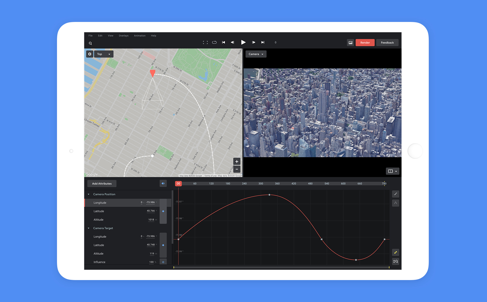

## Overview

The idea for Google Earth Studio came about when Google first launched realistic 3D footage of cities around the world. This created new opportunities to tell geographic stories in film. My small, agile team developed a proof of concept, then partnered with Google to bring this powerful browser-based motion design software to life. 

I was one of three core developers on the team. My responsibilities as full stack developer included devops, prototyping, frontend, backend and documentation. The latter eventually was utilized in a successful patent application for the app's concept.

Here's a video by [Jon Brennan](https://jon-brennan.com/), that walks you through the app's user interface and basic functionality:

<iframe className="w-full aspect-video" src="https://www.youtube.com/embed/OYg7dH2UbOU?modestbranding=1&rel=0" frameborder="0" allow="accelerometer; autoplay; encrypted-media; gyroscope; picture-in-picture" allowfullscreen></iframe>

## Examples

The following videos have been created using Google Earth Studio.

<iframe className="w-full aspect-video mt-10" src="https://www.youtube.com/embed/m1I8herpnbs?modestbranding=1&rel=0" frameborder="0" allow="accelerometer; autoplay; encrypted-media; gyroscope; picture-in-picture" allowfullscreen></iframe>

<iframe className="w-full aspect-video mt-10" src="https://www.youtube.com/embed/yrY-z5OmXpI?modestbranding=1&rel=0" frameborder="0" allow="accelerometer; autoplay; encrypted-media; gyroscope; picture-in-picture" allowfullscreen></iframe>

