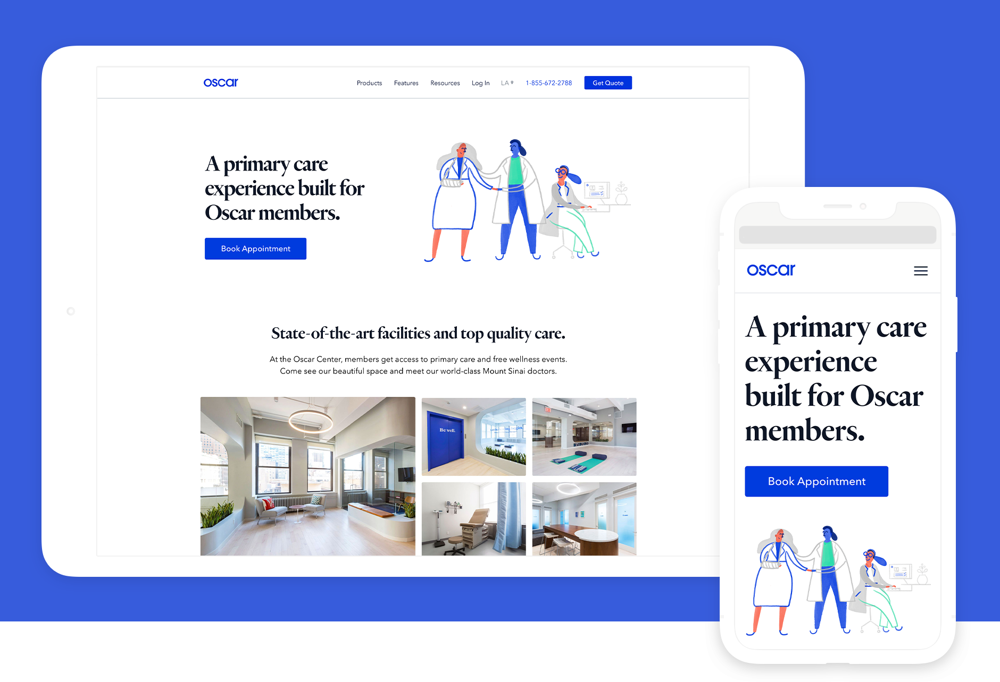
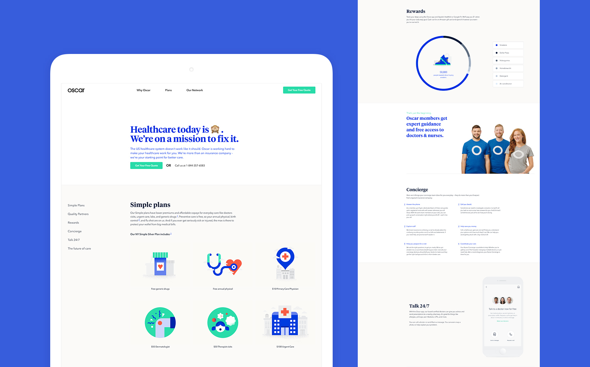
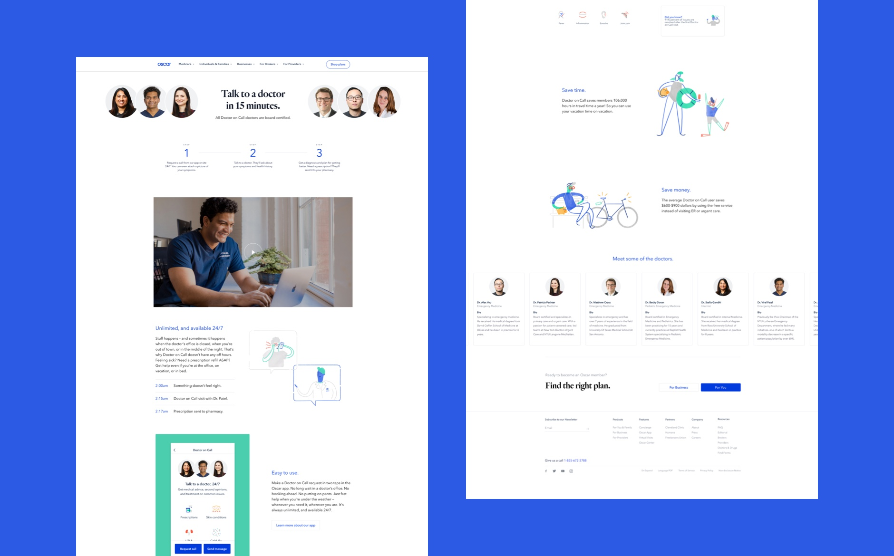
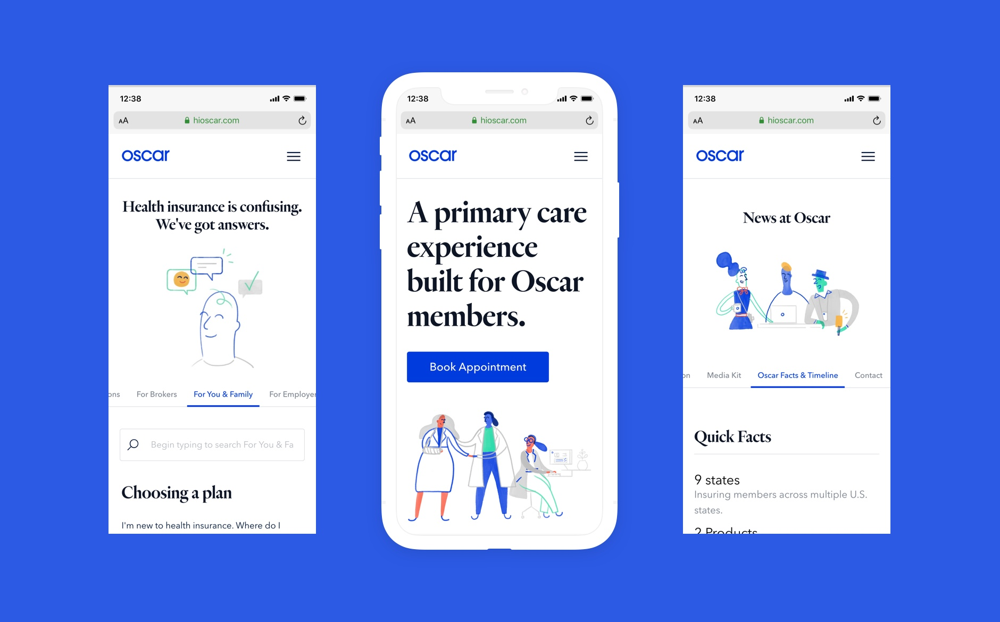
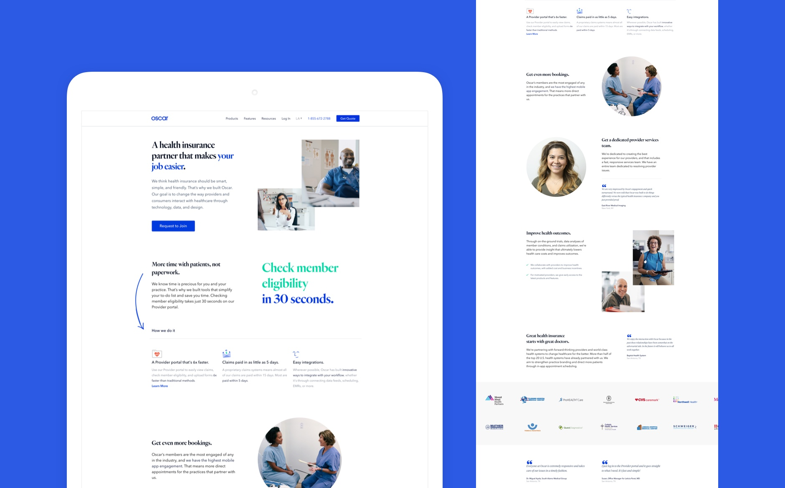

## Overview
When [Something New](https://somethingnew.co) took over Oscar's previous marketing presence, we had our work cut out for ourselves: content could not be indexed by search engines, most of it was hardcoded and due to the processes in place, even the smallest changes to the site took a day or two to go live. On top of it all, conversion had recently dropped significantly for reasons unknown to Oscar and at the same time, Open Enrollment was about to start — the ~2 month period that would almost single-handedly determine profits & losses for the next business year.

## The Stopgap
As a first bandaid solution, we quickly released a microsite that acted as the sole destination for any ongoing ad campaigns. Because this page lived outside of Oscar's existing infrastructure and processes, it allowed us to continously release small improvements to both its design and content in a rapid manner. Utilizing A/B tests and constant analysis of the conversion rate, this microsite would end up being the first of many succesful steps, to solve the problem we were facing.

## Data Driven Design
From the very start, analytics and user data played a huge role in how we approached the project, both from a design, as well as a development perspective. Digging into Oscar's analytics, we realized for example, that the majority of users fell into three groups of distinct screen resolutions and that the existing design ironically performed the worst at these exact breakpoints, with CTAs or whole sections becoming inaccessible. Through a series of rolling releases, we gradually fixed the critical functional issues - ranging from serverside rendering to accessible, responsive design - and then afterwards, one by one, moved individual pages over to a fully rebranded and re-engineered solution.

## The modular system
In collaboration with the design team, we created a library of modular React components, that were controlled through a headless CMS. In the CMS they could then be combined to create new pages easily and quickly, resulting in less overhead and a much faster time to market for new landing pages. This tremendously empowered Oscar's marketing team. Whether it was landing pages for specific email campaigns, or targetted landing pages tailored to very specific market segments, it helped Oscar have their best year in the company's history.

